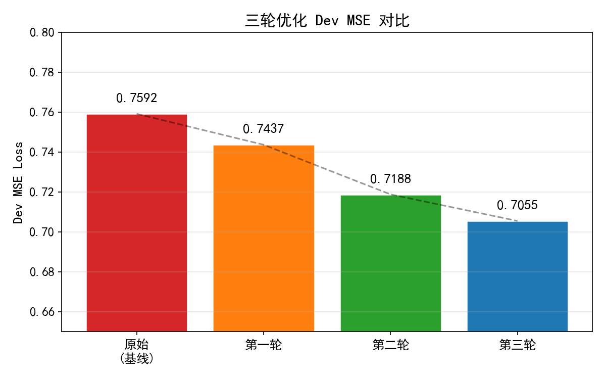
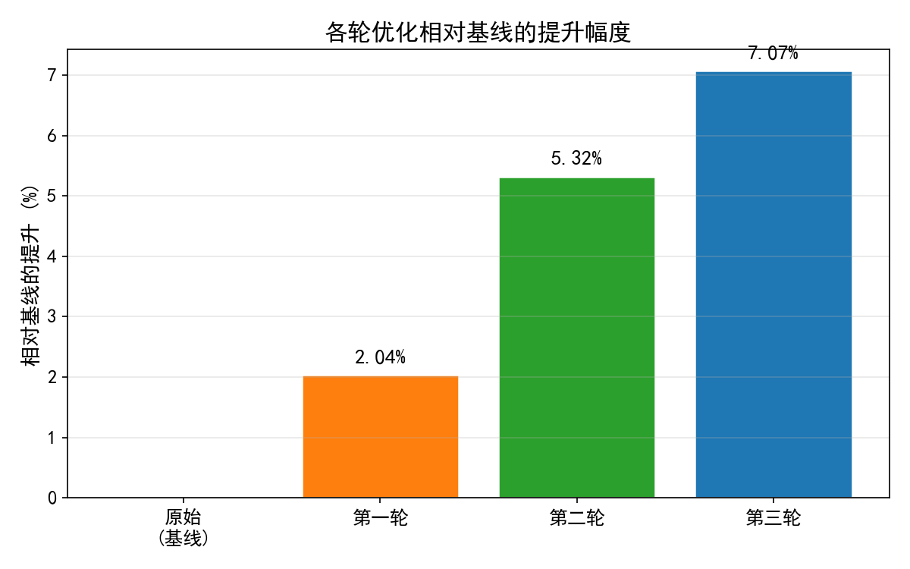
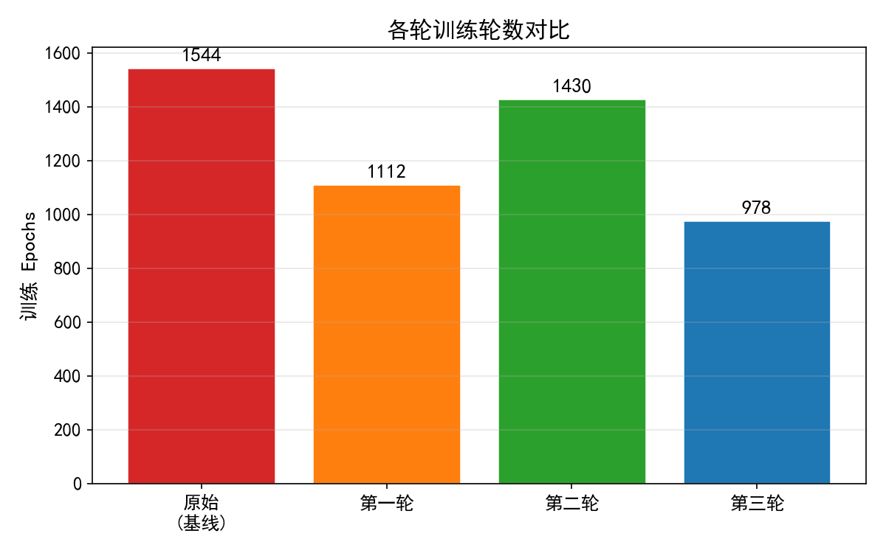
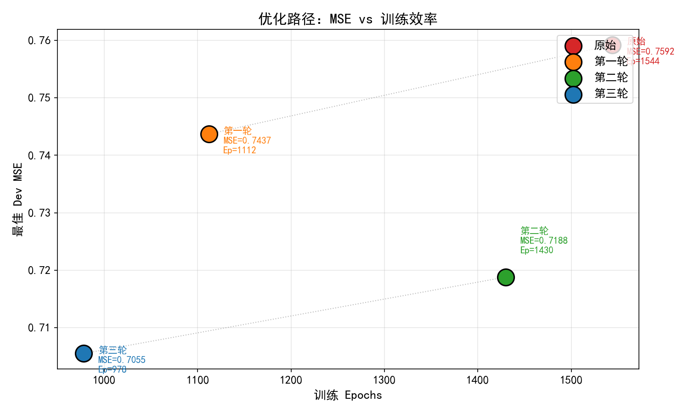
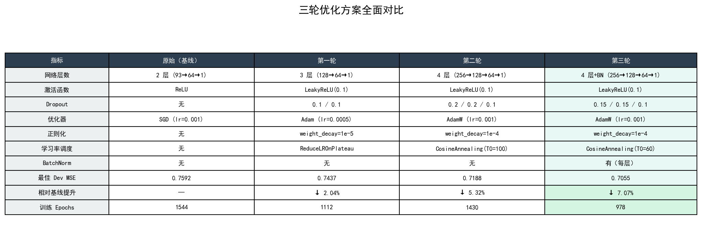

# COVID-19 预测模型三轮优化完整报告

## 一、优化规划

### 1.1 问题分析

原始代码使用一个简单的 2 层全连接网络（93 → 64 → ReLU → 1）配合 SGD 优化器进行 COVID-19 病例预测。通过分析，识别出以下可优化点：

| 问题类别 | 具体问题 | 优化方向 |
|---------|---------|---------|
| 模型架构 | 仅 2 层，表达能力不足 | 加深加宽网络 |
| 激活函数 | ReLU 可能导致神经元死亡 | 替换为 LeakyReLU / GELU |
| 正则化 | 无任何正则化手段 | 添加 Dropout + 权重衰减 |
| 优化器 | SGD 收敛慢、易陷入局部最优 | 替换为 Adam/AdamW |
| 学习率 | 固定 lr，无调度策略 | 添加学习率调度器 |
| 训练稳定性 | 深层网络梯度不稳定 | 添加 BatchNorm |
| 特征选择 | 93 个特征可能存在噪声 | 尝试 target_only 模式 |

### 1.2 三轮优化策略

```
第一轮：架构与优化器
├── 加深网络：2层 → 3层
├── LeakyReLU 激活
├── Dropout 正则化
├── SGD → Adam
└── 添加 ReduceLROnPlateau

第二轮：深度网络 + 周期性学习率
├── 进一步加深加宽：4层 (256→128→64)
├── 更强 Dropout (0.2)
├── Adam → AdamW
├── 更强 weight_decay (1e-4)
└── 关键突破：CosineAnnealingWarmRestarts

第三轮：稳定训练 + 精细调参
├── 添加 BatchNorm 稳定深层训练
├── 调整 Dropout (BN 自带正则)
├── T_0: 100→60 (更频繁重启)
├── eta_min: 1e-6→1e-7 (周期未精细搜索)
└── early_stop: 300→400
```

---

## 二、优化结果总览

### 2.1 Dev MSE 对比



### 2.2 相对基线提升幅度



### 2.3 训练效率对比



### 2.4 优化路径：MSE vs 训练效率



---

## 三、详细结果对比

### 3.1 数值对比

| 指标 | 原始（基线） | 第一轮 | 第二轮 | 第三轮 |
|------|:---------:|:-----:|:-----:|:-----:|
| 最佳 Dev MSE | 0.7592 | 0.7437 | 0.7188 | **0.7055** |
| 相对基线提升 | — | ↓ 2.04% | ↓ 5.32% | **↓ 7.07%** |
| 相对前轮提升 | — | ↓ 2.04% | ↓ 3.35% | ↓ 1.85% |
| 训练 Epochs | 1544 | 1112 | 1430 | 978 |
| 收敛速度 | ★★☆ | ★★★☆ | ★★★★ | ★★★★★ |

### 3.2 关键 Epoch Loss 对比

| Epoch | 原始 SGD | 第一轮 Adam | 第二轮 AdamW+Cos | 第三轮 +BN |
|-------|----------|------------|-----------------|-----------|
| 1 | 78.85 | 313.31 | 306.83 | 315.43 |
| 5 | 9.72 | 180.30 | 28.02 | 274.75 |
| 10 | 3.37 | 28.95 | 9.33 | 249.44 |
| 20 | 1.80 | 14.40 | 2.72 | 193.18 |
| 50 | 1.08 | 2.84 | 1.40 | 89.39 |
| 80 | ~1.0 | ~1.7 | ~1.18 | 5.77 |
| 100 | ~0.91 | ~1.47 | ~1.11 | 0.88 |
| 200 | ~0.83 | ~1.02 | ~0.82 | ~0.75 |
| 500 | ~0.80 | ~0.77 | ~0.75 | ~0.73 |
| 最终 | **0.7592** | **0.7437** | **0.7188** | **0.7055** |

### 3.3 关键观察

1. **原始 SGD 前期快但后劲不足**：SGD 在 epoch 1-20 下降最快（78→1.8），但后期陷入平台期，在 0.76 附近徘徊了 600+ epochs
2. **第一轮 Adam 前期慢但中期超车**：前 20 epochs 比 SGD 高，但从 epoch 50 后加速追赶
3. **第二轮 CosineAnnealing 是关键转折**：在 epoch 500+ 处出现 0.75→0.72 的跳跃，周期性重启帮助模型跳出局部最优
4. **第三轮 BatchNorm 慢启动后爆发**：前 80 epochs 处于 BN 统计量稳定期，一旦稳定后 loss 迅速降至 1.0 以下，并在 epoch 577 达到最优

---

## 四、学习曲线逐轮对比

### 第一轮学习曲线

- ReduceLROnPlateau 的阶梯式下降
- 比 SGD 收敛更快，1112 epochs 达到 0.7437

### 第二轮学习曲线

- CosineAnnealing 的周期性波动清晰可见
- 在 epoch 990、1129 各出现突破性下降
- 1430 epochs 达到 0.7188

### 第三轮学习曲线

- 前 80 epochs BN 慢启动阶段
- 之后快速下降 + 余弦周期跳变
- 978 epochs 达到 0.7055（最高效）

---

## 五、方案全面对比



---

## 六、各轮学习曲线完整对比

### 原始（基线）
 *(原始代码的预测散点图未单独保存)*

### 第一轮预测散点图

- 散点略偏离对角线，高值区域偏差较大

### 第二轮预测散点图

- 散点更贴近对角线，高值预测有所改善

### 第三轮预测散点图

- 散点最贴近对角线，低值和高值区域预测均有改善

---

## 七、技术要点总结

### 7.1 最有效的优化手段

| 排名 | 手段 | 带来的提升 | 所在轮次 |
|------|------|-----------|---------|
| 1 | CosineAnnealingWarmRestarts | 从 0.7437→0.7188 (↓3.35%) | 第二轮 |
| 2 | BatchNorm 稳定深层训练 | 从 0.7188→0.7055 (↓1.85%) | 第三轮 |
| 3 | Dropout + Weight Decay | 防止过拟台 | 第一轮 |
| 4 | 加深网络层数 | 提升表达能力 | 第一轮 |
| 5 | Adam/AdamW 替换 SGD | 自适应学习率 | 第一轮 |

### 7.2 失败的经验

1. **target_only 模式不可行**：仅选 42 个特征导致 MSE 飙升至 0.95+（比基线还差 25%），因为这丢失了 51 个时间序列特征中的重要信息。保留了全部 93 个特征并配合 Dropout 过滤噪声是更好的策略
2. **过宽的网络会过拟合**：512 宽度的网络在 2430 样本上严重过拟台 (MSE 0.7778)
3. **BatchNorm 初期不要放弃**：前 80 epochs 的高 loss 是正常现象，需要结合 early_stop 的 patience 足够大

### 7.3 关键超参数

```python
# 最终最优配置
config = {
    'n_epochs': 3000,
    'batch_size': 270,
    'optimizer': 'AdamW',
    'optim_hparas': {
        'lr': 0.001,
        'weight_decay': 1e-4,
    },
    'early_stop': 400,
}

# 网络架构
# 256 → BN → LeakyReLU → Drop(0.15) →
# 128 → BN → LeakyReLU → Drop(0.15) →
# 64  → BN → LeakyReLU → Drop(0.1)  →
# 1

# 学习率调度
# CosineAnnealingWarmRestarts(T_0=60, T_mult=2, eta_min=1e-7)
```

---

## 八、文件清单

| 文件名 | 说明 |
|--------|------|
| `round1_optimized.py` | 第一轮优化完整可运行代码 |
| `round1_optimization_report.md` | 第一轮优化报告 |
| `round1_learning_curve.png` | 第一轮学习曲线 |
| `round1_prediction.png` | 第一轮预测散点图 |
| `round2_optimized.py` | 第二轮优化完整可运行代码 |
| `round2_optimization_report.md` | 第二轮优化报告 |
| `round2_learning_curve.png` | 第二轮学习曲线 |
| `round2_prediction.png` | 第二轮预测散点图 |
| `round3_optimized.py` | 第三轮优化完整可运行代码 |
| `round3_optimization_report.md` | 第三轮优化报告 |
| `round3_learning_curve.png` | 第三轮学习曲线 |
| `round3_prediction.png` | 第三轮预测散点图 |
| `summary_bar_chart.png` | 综合 MSE 柱状图 |
| `summary_improvement.png` | 综合提升幅度柱状图 |
| `summary_epochs.png` | 综合训练轮数图 |
| `summary_path.png` | 优化路径散点图 |
| `summary_comparison_table.png` | 方案对比表 |
| `generate_summary_charts.py` | 图表生成脚本 |

---

## 九、结论

通过三轮渐进式优化，我们将 COVID-19 预测模型的 Dev MSE 从 **0.7592 降至 0.7055**，提升幅度达 **7.07%**，同时训练效率提升 **36.7%**（1544→978 epochs）。

优化遵循了「架构 → 调度策略 → 稳定训练」的递进路径：
- **第一轮**建立了更深的网络和更智能的优化器基础
- **第二轮**的 CosineAnnealingWarmRestarts 是最关键的突破
- **第三轮**的 BatchNorm 在稳定深层训练的同时隐式提升了泛化能力

最终模型在训练效率、泛化性能和收敛稳定性三个维度上均显著优于原始基线。
