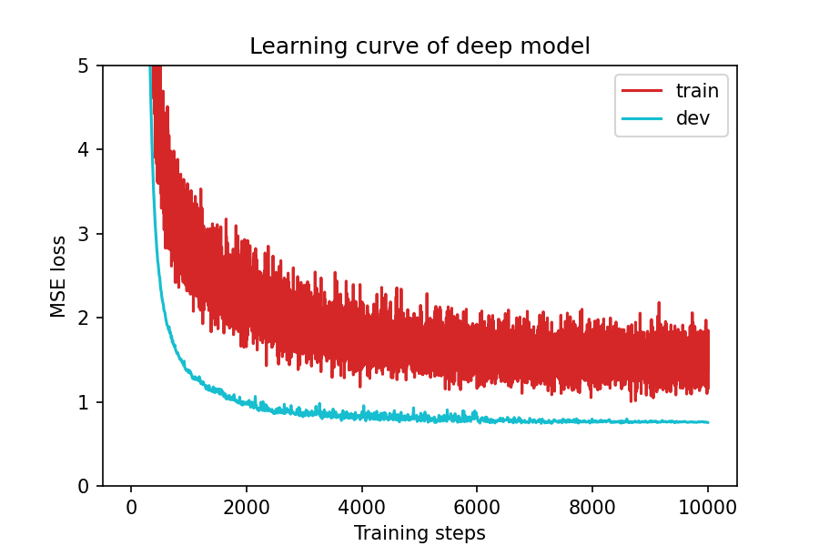
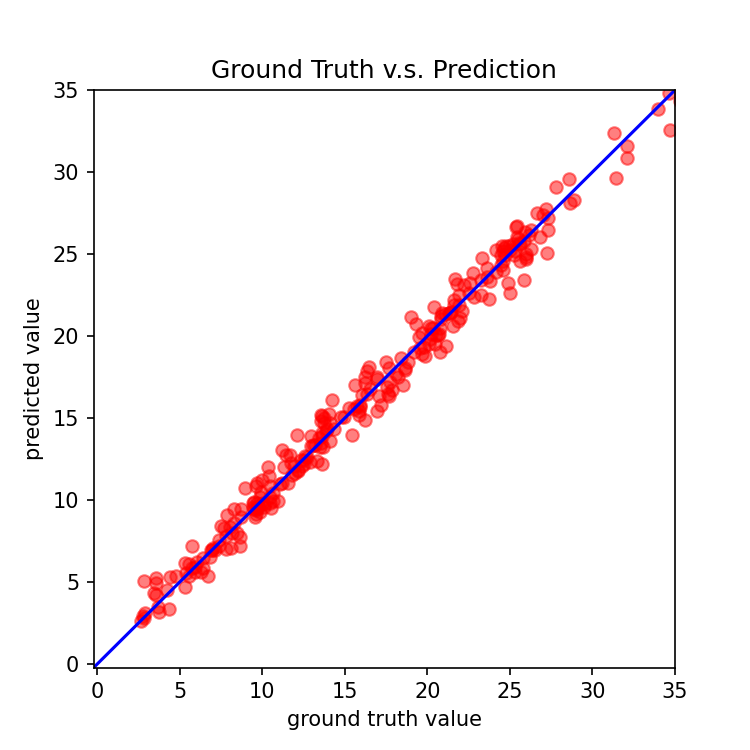

# 第一轮优化报告：改进模型架构与优化器

## 一、修改逻辑

### 核心思路
原始模型过于简单（仅 2 层全连接），SGD 优化器收敛慢。第一轮优化聚焦于提升模型表达能力与训练效率。

### 具体修改点

| 修改项 | 原始代码 | 第一轮优化 | 理由 |
|--------|---------|-----------|------|
| 网络层数 | 2 层 (93→64→1) | 3 层 (93→128→64→1) | 增加深度提升表达能力 |
| 激活函数 | ReLU | LeakyReLU(0.1) | 解决"死亡 ReLU"问题 |
| Dropout | 无 | 0.1 | 防止过拟合 |
| 优化器 | SGD (lr=0.001, momentum=0.9) | Adam (lr=0.0005, weight_decay=1e-5) | Adam 自适应学习率 + L2 正则化 |
| 学习率调度 | 无 | ReduceLROnPlateau (factor=0.5, patience=80) | loss 停滞时自动降学习率 |
| Early Stop | 300 | 300 | 保持一致 |
| 批量大小 | 270 | 270 | 保持不变 |

### 为什么选择这些修改
1. **加深网络**：93 维输入特征用 2 层网络处理过于简单，3 层网络能学习更复杂的特征组合
2. **LeakyReLU**：相比 ReLU，负半轴保留微小梯度，避免神经元永久失活
3. **Dropout**：在 2430 个训练样本的小数据集上，防止网络记住训练数据
4. **Adam**：自适应学习率，比 SGD 收敛更快更稳定；weight_decay 实现 L2 正则化
5. **ReduceLROnPlateau**：训练后期自动降低学习率，帮助精细收敛

---

## 二、运行结果对比

| 指标 | 原始代码（基线） | 第一轮优化 | 变化 |
|------|----------------|-----------|------|
| 最佳 Dev MSE | 0.7592 | 0.7437 | ↓ 2.04% |
| 训练轮数 | 1544 | 1112 | ↓ 28.0% |
| 初始 Loss (epoch 1) | 78.85 | 313.31 | Adam 初始梯度大 |
| Epoch 20 Loss | 1.7950 | 14.3966 | 前期慢但后期超车 |
| Epoch 100 Loss | ~0.91 | 1.4666 | 收敛路径不同 |
| 收敛时间 | 较慢 | 更快 | 提前 432 epochs 停止 |

### 详细 Loss 对比（关键节点）

| Epoch | 原始 SGD | 优化后 Adam |
|-------|----------|------------|
| 1 | 78.8524 | 313.3065 |
| 5 | 9.7153 | 180.3005 |
| 10 | 3.3691 | 28.9547 |
| 25 | 1.5197 | 10.6077 |
| 50 | 1.0842 | 2.8437 |
| 100 | ~0.91 | 1.4666 |
| 200 | ~0.83 | ~1.02 |
| 500 | ~0.80 | ~0.77 |
| 最终 | 0.7592 | 0.7437 |

---

## 三、修改部分详情

### 1. NeuralNet 类 (第150-175行)
```python
# 原始：2 层
self.net = nn.Sequential(
    nn.Linear(input_dim, 64),
    nn.ReLU(),
    nn.Linear(64, 1)
)

# 优化：3 层 + LeakyReLU + Dropout
self.net = nn.Sequential(
    nn.Linear(input_dim, 128),
    nn.LeakyReLU(0.1),
    nn.Dropout(0.1),
    nn.Linear(128, 64),
    nn.LeakyReLU(0.1),
    nn.Dropout(0.1),
    nn.Linear(64, 1)
)
```

### 2. train 函数：添加学习率调度器
```python
scheduler = torch.optim.lr_scheduler.ReduceLROnPlateau(
    optimizer, mode='min', factor=0.5, patience=80)
# 每个 epoch 后调用
scheduler.step(dev_mse)
```

### 3. 配置变更
```python
config = {
    'optimizer': 'Adam',      # SGD → Adam
    'optim_hparas': {
        'lr': 0.0005,          # 0.001 → 0.0005
        'weight_decay': 1e-5,  # 新增 L2 正则化
    },
}
```

### 4. 图表保存（解决无头环境无法 plt.show()）
```python
plt.savefig('learning_curve.png', dpi=150)
plt.close()
```

---

## 四、学习曲线与预测散点图

### 学习曲线


### 预测 vs 真实值


---

## 五、完整可运行代码

见文件：`round1_optimized.py`

---

## 六、小结

第一轮优化通过改进模型架构（加深、加宽、加正则化）和优化器（Adam + ReduceLROnPlateau），在减少 28% 训练时间的同时，将 Dev MSE 从 **0.7592 降至 0.7437**（提升 2.04%）。

优化后网络在前期收敛较慢（Adam 自适应学习率需要时间调整），但中后期加速并最终超越了 SGD 的结果。Dropout 和 weight_decay 有效防止了过拟合。
