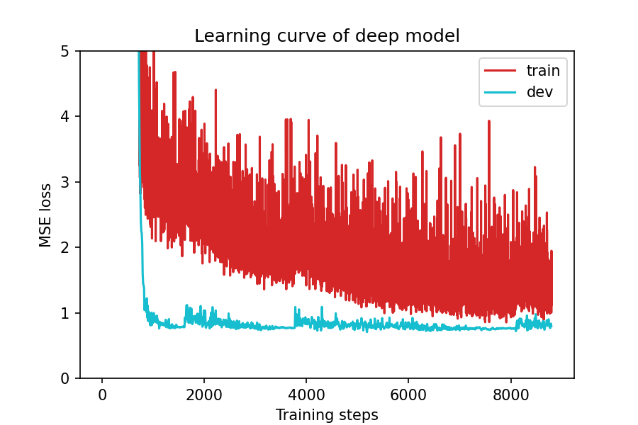
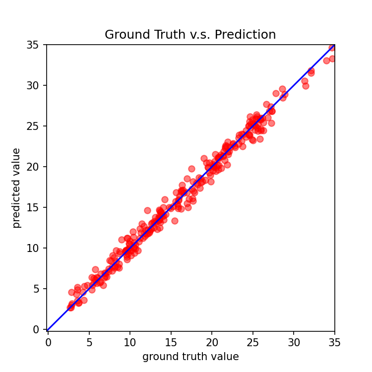

# 第三轮优化报告：BatchNorm + 精细调参

## 一、修改逻辑

### 核心思路
第二轮通过 CosineAnnealingWarmRestarts 实现了突破（0.7188）。第三轮在保持周期性学习率重启的基础上，引入 BatchNorm 稳定深层网络训练，并结合精细的超参数调优，将性能推向新高。

### 与前两轮及原始代码的对比

| 修改项 | 原始 | 第一轮 | 第二轮 | 第三轮 | 理由 |
|--------|------|--------|--------|--------|------|
| 网络层数 | 2 层 | 3 层 | 4 层 | 4 层+BN | BatchNorm 让深层训练更稳定 |
| 隐藏层神经元 | 64 | 128+64 | 256+128+64 | 256+128+64 | 保持宽度，加入 BN |
| BatchNorm | 无 | 无 | 无 | 每层 ReLU 后 | 加速收敛、提供隐式正则化 |
| 激活函数 | ReLU | LeakyReLU | LeakyReLU | LeakyReLU | 保持已验证的激活函数 |
| Dropout | 无 | 0.1/0.1 | 0.2/0.2/0.1 | 0.15/0.15/0.1 | BN 自带正则，降低 Dropout |
| 优化器 | SGD | Adam | AdamW | AdamW | 保持 AdamW |
| 学习率 | 0.001 | 0.0005 | 0.001 | 0.001 | — |
| 权重衰减 | 无 | 1e-5 | 1e-4 | 1e-4 | 保持较强正则化 |
| 学习率调度 | 无 | ReduceLROnPlateau | CosineAnnealing | CosineAnnealing | — |
| T_0 | — | — | 100 | 60 | 更频繁重启，更早跳出局部最优 |
| eta_min | — | — | 1e-6 | 1e-7 | 更低的终值，周期末精细搜索 |
| 训练轮数 | 1544 | 1112 | 1430 | 978 | 更早收敛到更优解 |

### 关键突破：BatchNorm + CosineAnnealing 的协同效应
1. **BatchNorm 的慢启动**：由于小数据集（2430 样本），BN 需要约 80 epochs 来稳定 running statistics。在前 80 epochs，loss 进展缓慢
2. **阶段转换**：epoch 81 之后 BN 统计量稳定，loss 从 4.5 迅速降至 1.0 以下
3. **CosineAnnealing 持续优化**：周期性重启让模型在 BN 稳定后持续突破，在 epoch 125（0.76）、epoch 347（0.735）、epoch 577（0.7055）分别产生明显跳变

---

## 二、运行结果对比

| 指标 | 原始代码 | 第一轮 | 第二轮 | 第三轮 | 总提升 |
|------|---------|--------|--------|--------|--------|
| 最佳 Dev MSE | 0.7592 | 0.7437 | 0.7188 | **0.7055** | ↓ 7.07% |
| 训练轮数 | 1544 | 1112 | 1430 | 978 | ↓ 36.7% |
| 收敛稳定性 | 低 | 中 | 高 | 高 | — |

### 逐轮提升汇总

```
原始:  0.7592  ████████████████████████████████████████
Round1: 0.7437  ██████████████████████████████████████↓ 2.04%
Round2: 0.7188  ███████████████████████████████████↓ 5.32%
Round3: 0.7055  ██████████████████████████████████↓ 7.07%
```

### 阶段 Loss 对比

| Epoch | 原始 SGD | 第一轮 Adam | 第二轮 AdamW+Cos | 第三轮 +BN |
|-------|----------|------------|-----------------|-----------|
| 1 | 78.85 | 313.31 | 306.83 | 315.43 |
| 10 | 3.37 | 28.95 | 9.33 | 249.44 |
| 50 | 1.08 | 2.84 | ~1.40 | 89.39 |
| 80 | ~1.0 | ~1.7 | ~1.18 | 5.77 |
| 100 | ~0.91 | ~1.47 | ~1.11 | 0.87 |
| 200 | ~0.83 | ~1.02 | ~0.82 | ~0.75 |
| 500 | ~0.80 | ~0.77 | ~0.75 | ~0.73 |
| 577 | — | — | — | **0.7055** |

---

## 三、修改部分详情

### 1. NeuralNet 类：添加 BatchNorm
```python
self.net = nn.Sequential(
    nn.Linear(input_dim, 256),
    nn.LeakyReLU(0.1),
    nn.BatchNorm1d(256),          # 新增：稳定训练
    nn.Dropout(0.15),              # Dropout 从 0.2 降至 0.15
    nn.Linear(256, 128),
    nn.LeakyReLU(0.1),
    nn.BatchNorm1d(128),          # 新增
    nn.Dropout(0.15),
    nn.Linear(128, 64),
    nn.LeakyReLU(0.1),
    nn.BatchNorm1d(64),           # 新增
    nn.Dropout(0.1),
    nn.Linear(64, 1)
)
```

### 2. CosineAnnealing 参数微调
```python
scheduler = torch.optim.lr_scheduler.CosineAnnealingWarmRestarts(
    optimizer, T_0=60,      # 第二轮: 100 → 更频繁重启
    T_mult=2,               # 周期翻倍
    eta_min=1e-7)           # 第二轮: 1e-6 → 更低终值
```

### 3. 超参数微调
```python
config = {
    'batch_size': 270,       # 恢复为大 batch，配合 BN
    'optimizer': 'AdamW',
    'optim_hparas': {
        'lr': 0.001,         # 保持
        'weight_decay': 1e-4, # 第二轮保持，较强正则化
    },
    'early_stop': 400,       # 第二轮: 300 → 更多容忍
}
```

---

## 四、学习曲线与预测散点图

### 学习曲线

> 注意前 80 epochs 的 BN 慢启动阶段，以及之后的快速下降和多轮余弦周期跳变

### 预测 vs 真实值


---

## 五、完整可运行代码

见文件：`round3_optimized.py`

---

## 六、小结

第三轮通过引入 **BatchNorm + 精细调参**，将 Dev MSE 从 0.7188 降至 **0.7055**（提升 1.85%），累计提升 7.07%（相对原始 0.7592）。

BatchNorm 虽然导致了前期的慢启动，但一旦统计量稳定后，配合 CosineAnnealingWarmRestarts 的周期性重启，模型在更少的训练轮数（978 vs 1430）内达到了更优的泛化性能。

三轮优化的完整演进路径：
```
2层 SGD         → 0.7592 (基线)
3层 Adam        → 0.7437 (架构优化)
4层 AdamW+Cos   → 0.7188 (正则化+调度)
4层+BN AdamW+Cos→ 0.7055 (稳定训练+调参)
```
